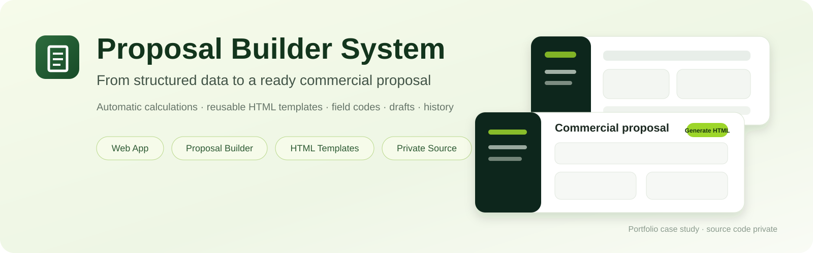
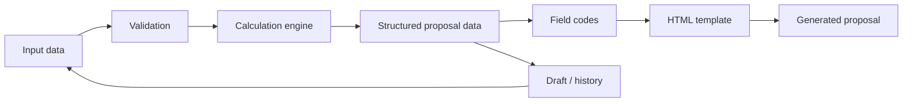

  <a href="README.md">Українська</a> · <a href="README.ru.md">Русский</a> · <b>English</b>

  

# Proposal Builder System

**Proposal Builder System** is a web application for preparing commercial proposals with automatic calculations, configurable HTML templates, stable field codes, and history for drafts and generated documents.

  
  
  
  
  
  

> [!IMPORTANT]
> This is a **public portfolio case study**. Production source code, operational configuration, and real customer data remain private.

| | |
|---|---|
| **Solution type** | Internal web application / proposal automation |
| **My role** | Process analysis, architecture, AI-assisted implementation, UI/UX, runtime validation |
| **Backend** | Python · Flask · Waitress |
| **Frontend** | JavaScript · HTML · CSS |
| **Core idea** | Structured data → calculations → reusable template → ready HTML proposal |
| **Status** | Working internal tool |

---

## 🖥️ Product Preview

These are **real application screens**, not mockups: the main proposal form, history, field codes, HTML designs, and calculation settings.

  

---

## 🎯 The problem

Preparing a complex commercial proposal manually requires repeating the same work: moving customer data between documents, calculating configuration and economics, tracking currency and rates, assembling the proposal in the correct design, and keeping intermediate versions.

The goal was to turn that work into a controlled workflow where the manager enters source data and the system performs calculations and generates the final document.

## 💡 The solution

The system separates **data**, **calculation logic**, and **visual design**. Formulas and business parameters can change independently from HTML templates, while the same structured proposal data can be reused across multiple designs.

---

## ✅ Implemented

### Proposal form and automatic calculations

A manager enters source parameters, prices, and configuration. Derived values are calculated by the system, while required fields are validated before saving or generating a proposal.

### Configurable parameters

A dedicated settings page stores defaults, regional coefficients, proposal validity periods, and other values used by the calculation model.

### HTML designs

Custom HTML templates can be uploaded to the system. Structured values are inserted through stable variables such as `{{client.name}}`, `{{formatted.projectCost}}`, and `{{calculations.annualGenerationKwh}}`.

### Field codes

A dedicated reference page exposes the available data structure and stable field codes, allowing proposal designs to evolve without coupling them to UI labels.

### Drafts and history

The workflow supports creating and saving drafts, editing an existing draft without duplicates, copying a generated proposal as the basis for a new one, reopening generated HTML proposals, and deleting history records.

### Recalculation on reopen

When saved proposal data is loaded, dynamic fields are restored and derived values are **recalculated** instead of blindly reusing old results. This keeps the proposal consistent after prices, formulas, or settings change.

### Backend API and safe updates

History operations use separate create/update API flows, including `PATCH` for draft editing. The backend validates input, checks record existence, and synchronizes access to history storage.

---

## 🔄 Workflow

| Step | What happens |
|---|---|
| **1. Input** | The manager enters customer, configuration, pricing, and source data |
| **2. Calculate** | The system performs technical and financial calculations |
| **3. Design** | An HTML design is selected or uploaded |
| **4. Generate** | Field codes are applied to the template and final HTML is produced |
| **5. Reuse** | A proposal can be reopened, copied, or continued from a draft |

---

## 🛠️ Technology Stack

`Python` · `Flask` · `Waitress` · `JavaScript` · `HTML/CSS` · `JSON` · `REST-style API` · `browser storage/history` · `HTML templating` · `runtime validation`

---

## 👤 My role

I converted a real proposal-preparation workflow into a data model and software process: defining entities, fields, formulas, validation rules, template mechanics, history behavior, and document reuse scenarios.

Development followed an **AI-assisted workflow**: I defined requirements and architecture, worked with the existing codebase, validated actual runtime behavior, and made acceptance/revision decisions while using LLMs to accelerate implementation and code analysis.

---

## 🏆 Result

Instead of assembling proposals manually, the system provides one controlled pipeline:

**structured input → validation → automatic calculations → template → ready proposal → history / reuse**

This case demonstrates end-to-end business-process automation: from understanding repetitive manual work and designing the data model to web UI, backend logic, templating, and practical use of the resulting document.

---

## 🎥 Demo / Source availability

The production source repository is **private**. This repository contains only the public portfolio case study and safe screenshots.

During a technical interview I can demonstrate the workflow, calculation logic, field-code system, and HTML-template mechanics without publishing production source code.
