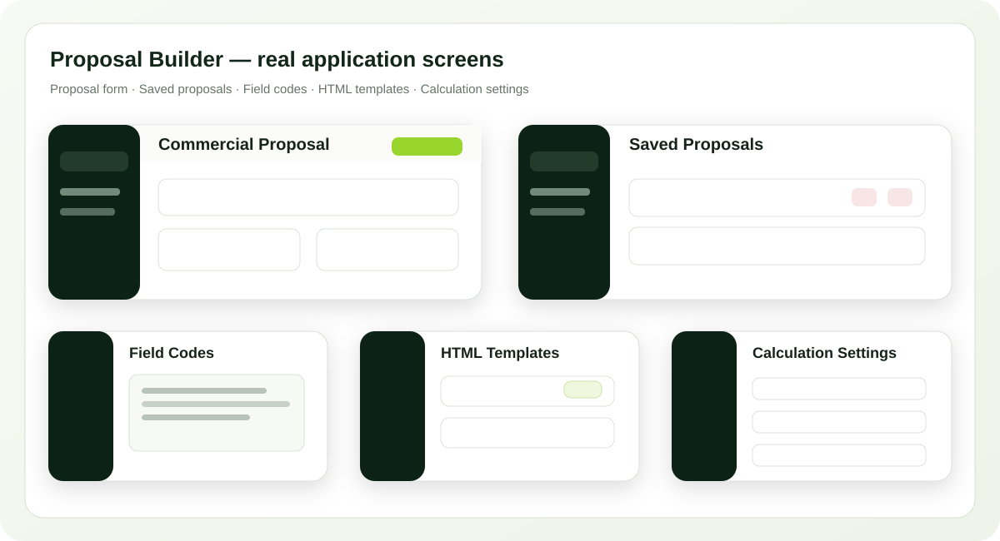
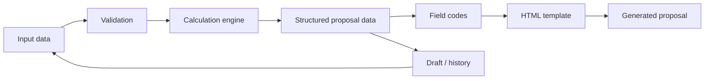

  <b>Українська</b> · <a href="README.ru.md">Русский</a> · <a href="README.en.md">English</a>

  

# Proposal Builder System

**Proposal Builder System** — web-застосунок для підготовки комерційних пропозицій із автоматичними розрахунками, керованими HTML-шаблонами, стабільними кодами полів та історією чернеток і готових документів.

  
  
  
  
  
  

> [!IMPORTANT]
> Це **публічний portfolio case study**. Production source code, робочі конфігурації та дані реальних клієнтів залишаються приватними.

| | |
|---|---|
| **Тип рішення** | Internal web application / proposal automation |
| **Моя роль** | Аналіз процесу, архітектура, AI-assisted implementation, UI/UX, runtime validation |
| **Backend** | Python · Flask · Waitress |
| **Frontend** | JavaScript · HTML · CSS |
| **Ключова ідея** | Structured data → calculations → reusable template → ready HTML proposal |
| **Статус** | Робочий інструмент |

---

## 🖥️ Product Preview

Нижче — **реальні екрани застосунку**, а не mockup: основна форма, історія, коди полів, HTML-дизайни та параметри розрахунків.

  

---

## 🎯 Задача

Підготовка складної комерційної пропозиції вручну вимагає повторювати одні й ті самі дії: переносити дані клієнта, рахувати конфігурацію та економіку, контролювати валюту й ставки, збирати документ у потрібному дизайні та зберігати проміжні версії.

Потрібно було перетворити цей процес на керований workflow, у якому менеджер вводить вихідні дані, а система сама виконує розрахунки та формує готовий документ.

## 💡 Рішення

Система розділяє **дані**, **розрахункову логіку** та **візуальний дизайн**. Це дозволяє змінювати формули й параметри незалежно від HTML-шаблонів і повторно використовувати той самий набір даних у різних дизайнах.

---

## ✅ Що реалізовано

### Комерційна форма та автоматичні розрахунки

Менеджер вводить вихідні параметри, ціни та конфігурацію. Розрахункові значення перераховуються системою, а перед збереженням чи генерацією обов'язкові поля проходять валідацію.

### Налаштовувані параметри

Окрема сторінка дозволяє задавати значення за замовчуванням, регіональні коефіцієнти, строки дії пропозиції та інші параметри, які використовує розрахункова модель.

### HTML-дизайни

До системи можна завантажувати власні HTML-шаблони. Дані підставляються через стабільні змінні на кшталт `{{client.name}}`, `{{formatted.projectCost}}` та `{{calculations.annualGenerationKwh}}`.

### Коди полів

Окремий довідник показує доступну структуру даних і стабільні field codes, тому дизайн можна змінювати без жорсткої прив'язки до підписів у формі.

### Чернетки та історія

Підтримуються:

- створення і збереження чернеток;
- редагування існуючої чернетки без створення дубліката;
- копіювання готової пропозиції як основи для нової;
- повторне відкриття сформованих HTML-пропозицій;
- видалення записів із історії.

### Перерахунок при повторному відкритті

При завантаженні збережених даних система відновлює динамічні поля та **перераховує** похідні значення замість сліпого використання старих результатів. Це важливо, коли ціни, формули або налаштування змінилися.

### Backend API та безпечне оновлення

Для історії використовуються окремі API-операції створення й оновлення, включно з `PATCH` для редагування чернеток. Backend валідовує дані, перевіряє наявність запису та синхронізує доступ до історії.

---

## 🔄 Робочий процес

| Крок | Що відбувається |
|---|---|
| **1. Input** | Менеджер вводить клієнта, конфігурацію, ціни та інші вихідні дані |
| **2. Calculate** | Система виконує технічні та фінансові розрахунки |
| **3. Design** | Обирається або завантажується HTML-дизайн |
| **4. Generate** | Field codes підставляються у шаблон і формується готовий HTML |
| **5. Reuse** | Пропозицію можна відкрити, скопіювати або продовжити з чернетки |

---

## 🛠️ Technology Stack

`Python` · `Flask` · `Waitress` · `JavaScript` · `HTML/CSS` · `JSON` · `REST-style API` · `browser storage/history` · `HTML templating` · `runtime validation`

---

## 👤 Моя роль

Я перетворила реальний процес підготовки комерційної пропозиції на структуру даних і програмний workflow: визначила сутності, поля, формули, правила валідації, механіку шаблонів, історію та сценарії повторного використання документів.

Розробка виконувалася в **AI-assisted workflow**: я задавала вимоги й архітектуру, працювала з існуючим кодом, перевіряла фактичну поведінку в runtime та приймала рішення щодо змін, використовуючи LLM для прискорення implementation і code analysis.

---

## 🏆 Результат

Замість ручного складання документів система дає один керований конвеєр:

**structured input → validation → automatic calculations → template → ready proposal → history / reuse**

Кейс демонструє автоматизацію бізнес-процесу повного циклу: від аналізу ручної роботи та моделі даних до web UI, backend logic, шаблонізації та реального використання результату.

---

## 🎥 Demo / Source availability

Production source repository є **приватним**. Тут опубліковано лише portfolio case study та безпечні screenshots.

На технічній співбесіді я можу показати робочий workflow, логіку розрахунків, систему field codes і механіку HTML-шаблонів без публікації production source code.
