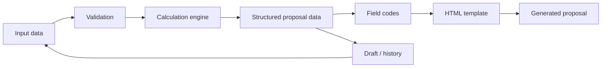

  <a href="README.md">Українська</a> · <b>Русский</b> · <a href="README.en.md">English</a>

  

# Proposal Builder System

**Proposal Builder System** — web-приложение для подготовки коммерческих предложений с автоматическими расчётами, управляемыми HTML-шаблонами, стабильными кодами полей и историей черновиков и готовых документов.

  
  
  
  
  
  

> [!IMPORTANT]
> Это **публичный portfolio case study**. Production source code, рабочие конфигурации и данные реальных клиентов остаются приватными.

| | |
|---|---|
| **Тип решения** | Internal web application / proposal automation |
| **Моя роль** | Анализ процесса, архитектура, AI-assisted implementation, UI/UX, runtime validation |
| **Backend** | Python · Flask · Waitress |
| **Frontend** | JavaScript · HTML · CSS |
| **Ключевая идея** | Structured data → calculations → reusable template → ready HTML proposal |
| **Статус** | Рабочий инструмент |

---

## 🖥️ Product Preview

Ниже — **реальные экраны приложения**, а не mockup: основная форма, история, коды полей, HTML-дизайны и параметры расчётов.

  

---

## 🎯 Задача

Подготовка сложного коммерческого предложения вручную заставляет повторять одни и те же действия: переносить данные клиента, считать конфигурацию и экономику, контролировать валюту и ставки, собирать документ в нужном дизайне и сохранять промежуточные версии.

Нужно было превратить этот процесс в управляемый workflow, где менеджер вводит исходные данные, а система сама выполняет расчёты и формирует готовый документ.

## 💡 Решение

Система разделяет **данные**, **расчётную логику** и **визуальный дизайн**. Благодаря этому формулы и параметры можно менять независимо от HTML-шаблонов, а один набор данных использовать в разных дизайнах.

---

## ✅ Что реализовано

### Коммерческая форма и автоматические расчёты

Менеджер вводит исходные параметры, цены и конфигурацию. Расчётные значения пересчитываются системой, а перед сохранением или генерацией обязательные поля проходят валидацию.

### Настраиваемые параметры

Отдельная страница позволяет задавать значения по умолчанию, региональные коэффициенты, срок действия предложения и другие параметры расчётной модели.

### HTML-дизайны

В систему можно загружать собственные HTML-шаблоны. Данные подставляются через стабильные переменные вроде `{{client.name}}`, `{{formatted.projectCost}}` и `{{calculations.annualGenerationKwh}}`.

### Коды полей

Отдельный справочник показывает доступную структуру данных и стабильные field codes, поэтому дизайн не привязан жёстко к подписям в форме.

### Черновики и история

Поддерживаются создание и сохранение черновиков, редактирование существующего черновика без дублей, копирование готового предложения как основы для нового, повторное открытие сформированных HTML-пропозиций и удаление записей.

### Пересчёт при повторном открытии

При загрузке сохранённых данных система восстанавливает динамические поля и **пересчитывает** производные значения вместо использования устаревших результатов. Это важно, если цены, формулы или настройки изменились.

### Backend API и безопасное обновление

Для истории используются отдельные API-операции создания и обновления, включая `PATCH` для редактирования черновиков. Backend валидирует данные, проверяет наличие записи и синхронизирует доступ к истории.

---

## 🔄 Рабочий процесс

| Шаг | Что происходит |
|---|---|
| **1. Input** | Менеджер вводит клиента, конфигурацию, цены и исходные данные |
| **2. Calculate** | Система выполняет технические и финансовые расчёты |
| **3. Design** | Выбирается или загружается HTML-дизайн |
| **4. Generate** | Field codes подставляются в шаблон и формируется готовый HTML |
| **5. Reuse** | Предложение можно открыть, скопировать или продолжить из черновика |

---

## 🛠️ Technology Stack

`Python` · `Flask` · `Waitress` · `JavaScript` · `HTML/CSS` · `JSON` · `REST-style API` · `browser storage/history` · `HTML templating` · `runtime validation`

---

## 👤 Моя роль

Я превратила реальный процесс подготовки коммерческого предложения в структуру данных и программный workflow: определила сущности, поля, формулы, правила валидации, механику шаблонов, историю и сценарии повторного использования документов.

Разработка велась в **AI-assisted workflow**: я задавала требования и архитектуру, работала с существующим кодом, проверяла фактическое поведение в runtime и принимала решения по изменениям, используя LLM для ускорения implementation и code analysis.

---

## 🏆 Результат

Вместо ручной сборки документов система даёт единый управляемый конвейер:

**structured input → validation → automatic calculations → template → ready proposal → history / reuse**

Кейс показывает автоматизацию бизнес-процесса полного цикла: от анализа ручной работы и модели данных до web UI, backend logic, шаблонизации и реального использования результата.

---

## 🎥 Demo / Source availability

Production source repository является **приватным**. Здесь опубликованы только portfolio case study и безопасные screenshots.

На техническом интервью я могу показать рабочий workflow, логику расчётов, систему field codes и механику HTML-шаблонов без публикации production source code.
